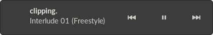
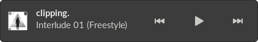

This extension works around a bug in [Spotify for
Linux](https://www.spotify.com/us/download/linux/) to allow GNOME Shell to
display the artwork for the currently-playing track in the notification menu.

## Before

## After

## Missing album art after installation
 - This is most likely due to a bug in GNOME Shell
 - As a work around, run `sudo setcap -r /usr/bin/gnome-shell`

## Installing
 - The extension can be installed [here](https://extensions.gnome.org/extension/4055/spotify-artwork-fixer/)
 - Alternatively, it can be built and installed from source:
   - `gnome-extensions pack --force`
   - `gnome-extensions install spotify-artwork-fixer@wjt.me.uk.shell-extension.zip --force`

## Technical details
 - The URLs Spotify gives for track artwork in its MPRIS D-Bus messages appear to
use the wrong domain, and return HTTP 404 when accessed
 - Replacing the domain in the URL works around the problem, that's what this extension does
 - Thanks to [FlyingPiMonster on the Spotify forums](https://community.spotify.com/t5/Desktop-Linux/Album-art-missing-from-notifications/m-p/4985666/highlight/true#M19705) for finding the correct domain

